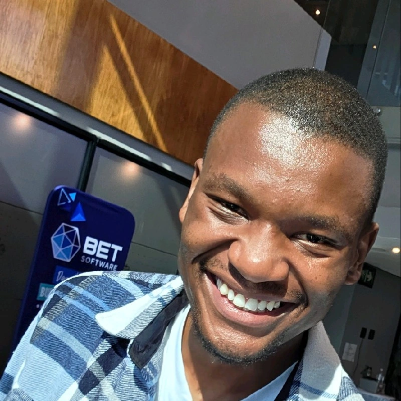

  

  

  
  
  
  

# Hey there! I'm Wandile Nkanyezi Ngobese

A curious explorer of technology, business, and problem-solving, always looking for creative ways to connect ideas across fields. With a BSc in Computer Science & IT, I'm now deepening my expertise in AI, sequence modeling, cloud ontologies, and the intersection between finance and technology.

## What I'm Working On
- Financial Quest - A gamified learning platform reimagining investment education for South Africa.
- IsiZulu -> English Translator - Bringing linguistic diversity into AI and NLP.
- Cloud Ontology Research - Mapping cloud resources intelligently for smarter digital ecosystems.
- AI and Image Recognition - Experimenting with the Art of Memory method using Python.

## Interests
- Investment and Gamification - Where psychology meets financial decision-making.
- AI and Computational Creativity - Teaching machines to think beyond the expected.
- Supercars and Mechanical Precision - Because engineering excellence is an art.
- Cross-disciplinary Problem Solving - Combining expertise from different domains to solve real-world challenges.

## Open to Collaboration
I'm open to teaming up on projects involving:
- AI / Machine Learning
- Gamified Learning
- NLP and Local-language AI
- Creative, technical problem-solving

## Tech Stack

  
  
  
  
  

## Pinned Projects

  
  

  
  

## Find Me Online
- Email: nkanyezingobese12@gmail.com
- LinkedIn: https://www.linkedin.com/in/wandile-ngobese-a09a91186
- GitHub: Well... you're already here :)

## Fun Fact
I enjoy stories that simplify complex ideas and spark curiosity.

## Always Learning | Always Experimenting

