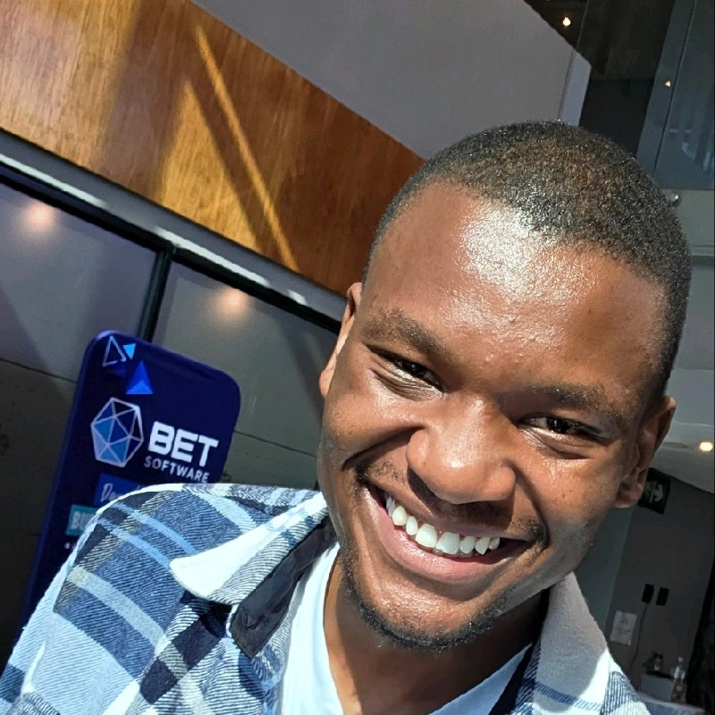

  

  

  
  
  
  

<h1 align="center">Hi, I'm Wandile Nkanyezi Ngobese</h1>

  <strong>Software Engineer / Developer with a Graduate Test Engineer foundation</strong> 
  <strong>Computer Science Honours Graduate | Builder of AI, learning, simulation, and finance-technology systems</strong>

## About Me

I am a Computer Science Honours graduate and Graduate Test Engineer based in South Africa. I build software systems while also developing strong quality-engineering discipline through app testing, API testing, regression testing, Java automation exposure, and test-environment work.

My profile is not only testing-focused. I am a developer who enjoys designing and building practical tools: adaptive learning platforms, recall-based study systems, finance-technology assistants, simulations, AI/NLP experiments, and data-driven applications.

Testing strengthens how I build because it keeps me focused on reliability, edge cases, user flows, repeatability, maintainability, and whether a system behaves correctly under real use.

## What I Build

* **Application software** - tools, dashboards, learning platforms, and personal productivity systems.
* **AI and learning systems** - adaptive learning, recall-based practice, NLP, and knowledge tooling.
* **Finance-technology tools** - investment-literacy systems, financial planning tools, and decision-support ideas.
* **Simulation and data projects** - systems modelling, congestion analysis, data wrangling, and operational insights.
* **Quality-focused software** - tested, maintainable, and user-aware systems informed by API, regression, and automation testing.

## Main Projects

<table>
  <tr>
    <td width="50%" valign="top">
      

        
      

      <h3 align="center">FinancialQuest</h3>
      
<strong>Unity • C# • Firebase • OWL/RDF • SHACL • Adaptive Learning</strong>

      

        An Honours research project titled <strong>FinancialQuest: A Unity-Based Ontology-Aligned Adaptive Learning Prototype for Investment Literacy Education in South Africa</strong>.
      

      

        It combines gamified learning, ontology-aligned content, adaptive progression, quiz mechanics, and finance education to make investment literacy more accessible.
      

      

        <a href="https://github.com/NkanyeziNgobese/FinancialQuest6">Repository</a>
      

    </td>
    <td width="50%" valign="top">
      

        
      

      <h3 align="center">AlgoRecall</h3>
      
<strong>JavaScript • Learning Systems • DSA • SRS • Developer Practice</strong>

      

        A private recall-based learning system for practicing data structures, algorithms, threading, concurrency, and system design through structured repetition and active recall.
      

      

        Built as a developer-training environment focused on doing, reviewing, tracking progress, and strengthening software engineering fundamentals.
      

      

        <strong>Status:</strong> Private project, available on request.
      

    </td>
  </tr>
  <tr>
    <td width="50%" valign="top">
      

        
      

      <h3 align="center">RouteZAR</h3>
      
<strong>Finance Technology • Local-First Tooling • Decision Support</strong>

      

        A finance-technology project focused on practical South African financial planning, cash-flow thinking, budgeting support, and decision guidance.
      

      

        RouteZAR reflects my interest in building software that connects computer science, finance, and everyday decision-making.
      

      

        <strong>Status:</strong> Private project, available on request.
      

    </td>
    <td width="50%" valign="top">
      

        
      

      <h3 align="center">Durban Port Congestion Simulation</h3>
      
<strong>Python • SimPy • Simulation • Data Analysis • Systems Thinking</strong>

      

        A data and systems simulation project modelling congestion patterns and bottlenecks in port operations, with a focus on queues, flow, operational constraints, and improvement scenarios.
      

      

        <a href="https://github.com/NkanyeziNgobese/PortSimulation">Repository</a>
      

    </td>
  </tr>
</table>

## Other Projects

<table>
  <tr>
    <td width="33%" valign="top">
      <h3>Ares-1</h3>
      
<strong>Simulation • Diagnostics • Agentic Thinking</strong>

      

        A project exploring simulation diagnostics, bottleneck reasoning, and structured improvement loops.
      

      

        <a href="https://github.com/NkanyeziNgobese/ares_1">Repository</a>
      

    </td>
    <td width="33%" valign="top">
      <h3>IsiZulu → English Translator</h3>
      
<strong>NLP • Local-Language AI • Translation</strong>

      

        An NLP project exploring translation and language accessibility for South African language contexts.
      

    </td>
    <td width="33%" valign="top">
      <h3>RSA Coin Recognition</h3>
      
<strong>Python • Image Processing • Computer Vision</strong>

      

        An Honours coursework project focused on recognising South African coins using image-processing techniques.
      

    </td>
  </tr>
</table>

## Engineering Identity

I position myself as a software developer with a quality-engineering advantage.

Testing gives me a stronger engineering lens: I think about failure paths, interfaces, inputs, outputs, regressions, edge cases, and whether a system behaves correctly under real use. Development gives me the ability to design and build the systems I want to test, improve, and scale.

## Tech Stack

  
  
  
  
  
  

  
  
  
  

  
  
  
  
  

## Collaboration Interests

I am open to collaborating on projects involving:

* Software engineering and application development
* Software testing, automation, and quality engineering
* AI / machine learning
* NLP and local-language technology
* Gamified learning and education technology
* Data-driven simulations and decision-support systems
* Finance technology and investment-literacy tools

## Find Me Online

* **Email:** [nkanyezingobese12@gmail.com](mailto:nkanyezingobese12@gmail.com)
* **LinkedIn:** https://www.linkedin.com/in/wandile-ngobese-a09a91186
* **GitHub:** You're already here.
